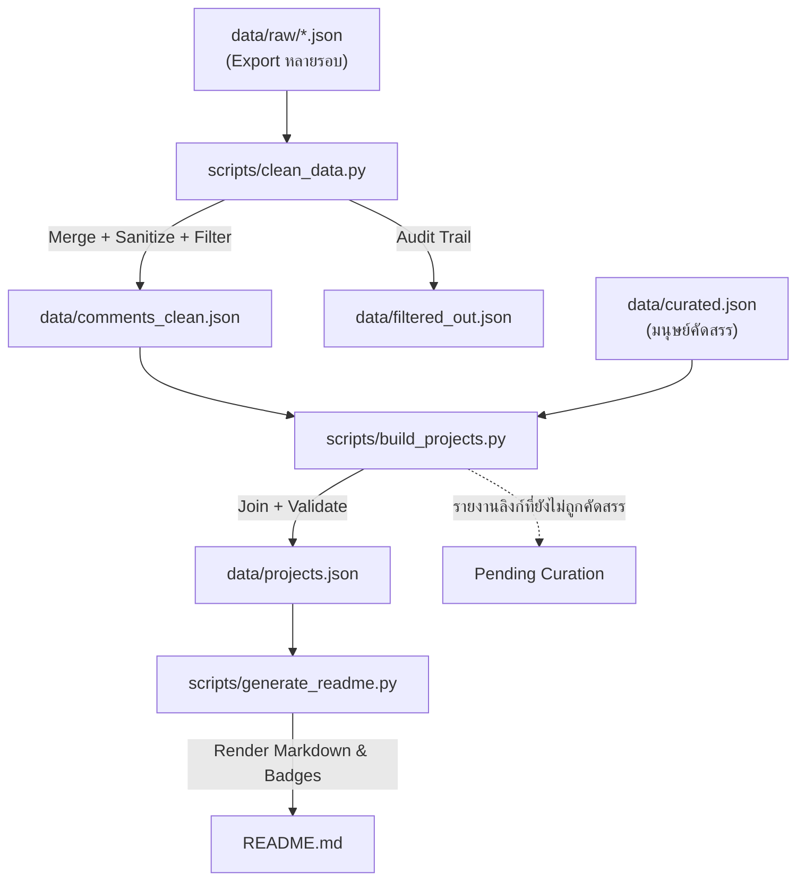

# 📋 Project Specification & Requirements (ข้อกำหนดและแนวทางการพัฒนาระบบ)

เอกสารสรุปข้อกำหนด (Requirements), มาตรฐานโครงสร้างข้อมูล (Data Specifications) และแนวทางการจัดการข้อมูลส่วนบุคคลสำหรับคลังข้อมูล **Awesome Thai AI Projects**

---

## 1. 🎯 วัตถุประสงค์ (Objectives)

1. **Data Extraction & Curation**: สกัดรายชื่อผลิตภัณฑ์ เว็บไซต์ เครื่องมือ และระบบที่พัฒนาด้วย Claude / AI จากคอมเมนต์ในกลุ่ม Facebook
2. **Privacy & PDPA Compliance**: ปรับปรุงและล้างข้อมูล (Sanitize) เพื่อป้องกันการรั่วไหลของข้อมูลส่วนบุคคล (PII) และ Session Tokens
3. **Structured Dataset**: จัดเก็บข้อมูลในรูปแบบ Clean JSON Schema ที่ค้นหา วิเคราะห์ และต่อยอดได้ง่าย
4. **Automated Presentation**: มีระบบสร้างเอกสารนำเสนอ `README.md` อัตโนมัติในรูปแบบ Awesome List ที่สวยงามและพร้อมสำหรับเผยแพร่บน GitHub

---

## 2. 📂 โครงสร้างไดเรกทอรี (Directory Structure)

```text
awesome-thai-ai-projects/
├── data/
│   ├── raw/                     # ⛔ ไม่ Track ใน Git (มี PII + CDN Session Token)
│   │   ├── facebook_feed.json   # ไฟล์ Export ดิบ (วางไฟล์ Export ใหม่เพิ่มในโฟลเดอร์นี้ได้)
│   │   └── YYYY-MM-DD-HH-MM.json
│   ├── comments_clean.json      # 🤖 Generated — คอมเมนต์ที่ผ่านการล้าง PII และตัด Metadata แล้ว
│   ├── filtered_out.json        # ⛔ ไม่ Track ใน Git — Audit Trail ของ Noise Filter
│   ├── curated.json             # ✍️ Source of truth ของข้อมูลที่มนุษย์คัดสรร (แก้ไขไฟล์นี้)
│   └── projects.json            # 🤖 Generated — ฐานข้อมูลโปรเจกต์พร้อมใช้งาน (ห้ามแก้ด้วยมือ)
├── scripts/
│   ├── clean_data.py            # รวม Export ทุกไฟล์, ลบ PII, กรอง Noise → comments_clean.json
│   ├── build_projects.py        # join comments_clean.json × curated.json + Validate → projects.json
│   └── generate_readme.py       # Render README.md จากฐานข้อมูล JSON
├── README.md                    # 🤖 Generated — เอกสารหลักสำหรับแสดงผลงานบน GitHub
├── REQUIREMENTS.md              # เอกสารข้อกำหนดและแนวทางการพัฒนานี้
├── LICENSE                      # สัญญาอนุญาตการใช้งาน (MIT License)
└── .gitignore                   # กำหนดไฟล์ที่ไม่ต้อง Track ใน Git
```

> **หมายเหตุเรื่องไฟล์ที่ไม่ Track ใน Git** (ดู §7)
> * `data/raw/` และ `input.json` — ไฟล์ Export ดิบมี `actor.id`, `profile_url`
>   และ CDN Query Token (`oh=`, `oe=`, `_nc_ohc=`) ที่ยังไม่หมดอายุ
> * `data/filtered_out.json` — รายการที่ถูกกรองด้วยเหตุผล `name-tag` คือ **ชื่อ-นามสกุลจริง**
>   ของสมาชิก ซึ่งเป็น PII ตาม §3.1 โดยตรง ผู้ที่มี `data/raw/` สามารถ Generate ไฟล์นี้
>   ขึ้นมาตรวจสอบในเครื่องตัวเองได้เสมอ

---

## 3. 🛡️ ข้อกำหนดการล้างและคัดกรองข้อมูล (Data Cleaning & Privacy Rules)

### 3.1 ฟิลด์และข้อมูลที่ต้องตัดออก (Omit / Mask)
* **User Identity & Personal Profile**:
  * `actor.profile_picture.uri` ที่มี CDN Query Tokens ชั่วคราว (`oh=...`, `oe=...`, `nc_sid=...`)
  * `actor.id`, `actor.url`, `actor.profile_url`
* **Facebook Internal GraphQL Artifacts**:
  * ฟิลด์เทคนิคที่ไม่เกี่ยวข้องกับเนื้อหา: `__typename`, `__isActor`, `__isEntity`, `story_bucket`, `work_info`, `show_promode_badge`, `cursor`, `feedback_id`, `root`
* **Noise & Low-value Messages**:
  * ข้อความสัญลักษณ์/ตัวอักษรเดี่ยว: `"."`, `"📍"`, `"..."`, `"。"`, `"👀"`
  * ข้อความ Follow-up ทั่วไป: `"รออ่าน"`, `"มารออ่านครับ"`, `"ตามครับ"`, `"ชื่นชมครับ"`
  * คอมเมนต์ที่มีเพียงการแท็กชื่อบัญชีผู้ใช้อื่นโดยไม่มีเนื้อหา
  * คอมเมนต์ที่ไม่มีลิงก์และมีความยาว (ไม่นับ Emoji) น้อยกว่า 10 ตัวอักษร

> **กฎสำคัญ**: คอมเมนต์ที่มีลิงก์จะ **ไม่ถูกกรองออกเด็ดขาด** เพราะถือเป็นผลงานที่สมาชิกตั้งใจแชร์
> และคอมเมนต์ที่เป็นชื่อผลิตภัณฑ์ (มีคำอย่าง `AI`, `App`, `Bot`, `Form`, `Builder`, `POS` …)
> จะถูกเก็บไว้แม้จะมีรูปแบบเหมือนการแท็กชื่อ

### 3.2 ฟิลด์ที่ต้องเก็บรักษา (Retain)
* `message`: เนื้อหาข้อความอธิบายโปรเจกต์
* `urls`: ลิงก์ภายนอกไปยังเว็บไซต์, GitHub, App Store, Play Store หรือสื่อที่เกี่ยวข้อง
* `timestamp` / `created_at`: วันและเวลาที่โพสต์ (แปลงเป็นมาตรฐาน ISO-8601 UTC)
* `reaction_count`, `comment_count`: ข้อมูลสถิติความสนใจ (สำหรับจัดอันดับ)

### 3.3 การสกัดลิงก์ (URL Extraction)
สมาชิกจำนวนมากพิมพ์โดเมนเปล่าโดยไม่ใส่ `https://` (เช่น `nubjarn.com`, `www.oneclickmcp.com`)
สคริปต์จึงต้องจับทั้งรูปแบบที่มี Scheme และโดเมนเปล่าที่ลงท้ายด้วย TLD ที่รู้จัก
แล้ว Normalize ให้อยู่ในรูป `https://` — หากจับเฉพาะ `https?://` จะสูญเสียลิงก์ไปราว 1 ใน 3 ของทั้งหมด

### 3.4 Auditability (ตรวจสอบย้อนหลังได้)
คอมเมนต์ทุกรายการที่ถูกกรองออกจะถูกบันทึกลง `data/filtered_out.json` พร้อมเหตุผล
(`empty`, `symbols-only`, `follow-up`, `too-short`, `name-tag`) เพื่อให้ตรวจสอบ False Positive
และกู้คืนรายการที่กรองผิดพลาดได้ — ไม่มีข้อมูลใดหายไปโดยไม่มีร่องรอย

> ⚠️ ไฟล์นี้ **ไม่ถูก Commit** เพราะรายการที่กรองด้วยเหตุผล `name-tag` คือชื่อจริงของสมาชิก
> ถือเป็น Local Artifact สำหรับตรวจสอบ Filter ในเครื่องผู้พัฒนาเท่านั้น

### 3.5 การรวมไฟล์ Export หลายรอบ (Merging Snapshots)
ไฟล์ Export คือ Snapshot ของกระทู้ที่ยังมีการเปลี่ยนแปลง การดึงรอบใหม่อาจ **มีคอมเมนต์เพิ่ม**,
**ขาดคอมเมนต์ที่ถูกลบไปแล้ว** หรือ **มีข้อความที่ถูกแก้ไข** สคริปต์จึงรวมไฟล์ทุกไฟล์ใน `data/raw/`
เข้าด้วยกันโดยใช้ `id` เป็นกุญแจ — คอมเมนต์ที่หายไปจาก Export ใหม่จะยังคงอยู่
ส่วนคอมเมนต์ที่ถูกแก้ไขจะใช้เวอร์ชันจากไฟล์ล่าสุด

---

## 4. 📊 มาตรฐานข้อมูล (Data Schemas)

### 4.1 Schema ของ `data/projects.json`
```json
{
  "$schema": "http://json-schema.org/draft-07/schema#",
  "type": "array",
  "items": {
    "type": "object",
    "required": ["id", "name", "category", "description", "tags"],
    "properties": {
      "id": {
        "type": "string",
        "description": "รหัสระบุเฉพาะของโปรเจกต์ เช่น ai-001, biz-001"
      },
      "name": {
        "type": "string",
        "description": "ชื่อของโปรเจกต์ หรือ ผลิตภัณฑ์"
      },
      "category": {
        "type": "string",
        "enum": [
          "AI Tools & Agents",
          "Business & SaaS",
          "Finance & Wealth",
          "Games & Entertainment",
          "Productivity & Lifestyle",
          "Real Estate & Construction",
          "E-Commerce & Marketing",
          "Health & Public Safety",
          "Hardware & Developer Tools"
        ]
      },
      "url": {
        "type": "string",
        "description": "URL เว็บไซต์ หรือ ลิงก์ดาวน์โหลด (เว้นว่างได้หากไม่มี)"
      },
      "description": {
        "type": "string",
        "description": "คำอธิบายฟีเจอร์ จุดเด่น และประโยชน์ของระบบ"
      },
      "tags": {
        "type": "array",
        "items": { "type": "string" },
        "description": "แท็กเทคโนโลยีหรือประเภทงาน เช่น [\"AI\", \"SaaS\", \"iOS\"]"
      },
      "raw_comment": {
        "type": "string",
        "description": "ข้อความคอมเมนต์ต้นฉบับของผู้พัฒนา (คัดลอกตรงจาก comments_clean.json)"
      },
      "source_id": {
        "type": "string",
        "description": "id ของคอมเมนต์ต้นทางใน comments_clean.json (ใช้ตรวจสอบย้อนกลับ)"
      },
      "created_at": {
        "type": ["string", "null"],
        "description": "เวลาที่คอมเมนต์ถูกโพสต์ (ISO-8601 UTC)"
      }
    }
  }
}
```

> `data/projects.json` เป็นไฟล์ที่ถูก **Generate** ขึ้นใหม่ทุกครั้งที่รัน `build_projects.py`
> ห้ามแก้ไขด้วยมือ เพราะการแก้ไขจะถูกเขียนทับ

### 4.2 Schema ของ `data/curated.json`
ไฟล์นี้คือ **Source of Truth** ของข้อมูลส่วนที่สคริปต์อนุมานเองไม่ได้ (ชื่อ, หมวดหมู่, คำอธิบาย, แท็ก)
โดยเชื่อมกลับไปยังคอมเมนต์ต้นทางด้วย `source_id`

```json
{
  "$schema": "http://json-schema.org/draft-07/schema#",
  "type": "array",
  "items": {
    "type": "object",
    "required": ["id", "source_id", "name", "category", "description", "tags"],
    "properties": {
      "id":          { "type": "string", "description": "รหัสเฉพาะ เช่น ai-001 (ห้ามซ้ำ)" },
      "source_id":   { "type": "string", "description": "id ของคอมเมนต์ใน comments_clean.json" },
      "name":        { "type": "string" },
      "category":    { "type": "string", "description": "ต้องเป็นค่าใดค่าหนึ่งใน enum ของ §4.1" },
      "url":         { "type": "string", "description": "เว้นว่างได้หากผู้พัฒนาไม่ได้แชร์ลิงก์" },
      "description": { "type": "string" },
      "tags":        { "type": "array", "items": { "type": "string" }, "minItems": 1 }
    }
  }
}
```

### 4.3 การตรวจสอบอัตโนมัติ (Validation)
`build_projects.py` จะหยุดการทำงานพร้อมรายงานข้อผิดพลาดเมื่อพบกรณีต่อไปนี้
* ฟิลด์ที่จำเป็นขาดหายหรือเป็นค่าว่าง
* `category` ไม่อยู่ใน enum ของ §4.1
* `tags` ไม่ใช่ Array หรือเป็น Array ว่าง
* `id` ซ้ำกัน
* `source_id` หาไม่พบใน `comments_clean.json`

นอกจากนี้จะรายงาน **Pending Curation** คือคอมเมนต์ที่มีลิงก์แต่ยังไม่มีใครคัดสรร
เพื่อให้เห็นช่องว่างของความครอบคลุมอยู่เสมอ

---

## 5. 🏷️ การจัดหมวดหมู่ (Taxonomy / Categories)

| หมวดหมู่ (Category) | คำอธิบายและขอบเขต |
| :--- | :--- |
| **🤖 AI Tools & Agents** | เครื่องมือ AI, แชทบอท, AI Agents, MCP Servers, Desktop Automation, Speech-to-Text |
| **💼 Business & SaaS** | ระบบ POS, ERP, CRM, ระบบบัญชี, ระบบขนส่ง TMS, ระบบจัดการงานในองค์กร |
| **💰 Finance & Wealth** | การวางแผนภาษี, วางแผนเกษียณ, บันทึกรายรับ-รายจ่าย, การหารบิล, บอร์ดเกมการเงิน |
| **🎮 Games & Entertainment** | Game Engine, เกมแนว RPG, บอร์ดเกมออนไลน์, เกม 3D, แพลตฟอร์มสร้างวิดีโอ AI |
| **📱 Productivity & Lifestyle** | แอป To-Do, LINE Notification Bot, Daily Check-in, ตู้โชว์ของสะสม, วางแผนซ้อมวิ่ง |
| **🏗️ Real Estate & Construction** | โปรแกรมถอดแบบก่อสร้าง, วิศวกรรมโยธา, แผนที่ทรัพย์บังคับคดี, แผนที่ GIS สาธารณภัย |
| **🛒 E-Commerce & Marketing** | เช็คประวัติราคาสินค้า, ระบบบริหารจัดการ Affiliate, ระบบควบคุม Ads, Auto-post |
| **🏥 Health & Public Safety** | ประเมินความเสี่ยงหมากัด/วัคซีน, แอปออกกำลังกาย, ระบบบริหารโรงเรียน, ระบบกู้ชีพ SOS |
| **🛠️ Hardware & Developer Tools** | Desktop Widgets, เครื่องมือจัดการคีย์การ์ด/NFC, พรีเซ็ตภาพถ่าย, Game Server Hosting |

---

## 6. 🔄 ลำดับขั้นตอนการทำงาน (Workflow & Execution Pipeline)



### คำสั่งสำหรับรัน Pipeline:
```bash
# ขั้นตอนที่ 1: รวม Export ทุกไฟล์ใน data/raw/ ล้าง PII และกรอง Noise
python3 scripts/clean_data.py

# ขั้นตอนที่ 2: join คอมเมนต์เข้ากับ curated.json ตรวจสอบ Schema แล้วสร้าง projects.json
python3 scripts/build_projects.py

# ขั้นตอนที่ 3: สร้างเอกสาร README.md
python3 scripts/generate_readme.py
```

> Pipeline เป็น **Deterministic** — รันซ้ำด้วย Input เดิมจะได้ Output ที่เหมือนกันทุก Byte
> เมื่อมีไฟล์ Export ใหม่ เพียงวางไว้ใน `data/raw/` แล้วรันขั้นตอนที่ 1 ใหม่

---

## 7. ⚖️ มาตรฐานการเผยแพร่ (Publishing Guidelines)
* ตรวจสอบว่าไฟล์ `data/raw/` ไม่มีข้อมูล credentials หรือ session keys
* เพิ่มสิทธิ์การอนุญาตผ่านสัญญาอนุญาตแบบ Open Source ในไฟล์ `LICENSE` (MIT License)
* ตรวจสอบว่า `data/raw/`, `input.json` และ `data/filtered_out.json` ถูกกำหนดไว้ใน `.gitignore` ก่อน Commit แรกเสมอ
* ไฟล์ที่เผยแพร่ได้มีเพียง 3 ไฟล์: `data/comments_clean.json`, `data/curated.json` และ `data/projects.json`

### 7.1 การร่วมสมทบข้อมูล (Contributing)
1. เพิ่มรายการใหม่ลงใน **`data/curated.json`** โดยระบุ `source_id` ให้ตรงกับ `id` ของคอมเมนต์ใน `data/comments_clean.json`
2. รัน `python3 scripts/build_projects.py` เพื่อตรวจสอบ Schema และสร้าง `data/projects.json` ใหม่
3. รัน `python3 scripts/generate_readme.py` แล้วเปิด Pull Request

> ⚠️ **อย่าแก้ `data/projects.json` หรือ `README.md` ด้วยมือ** ทั้งสองไฟล์เป็น Generated Output
> ที่จะถูกเขียนทับทุกครั้งที่รันสคริปต์ — การแก้ไขต้องทำที่ `data/curated.json` เท่านั้น
